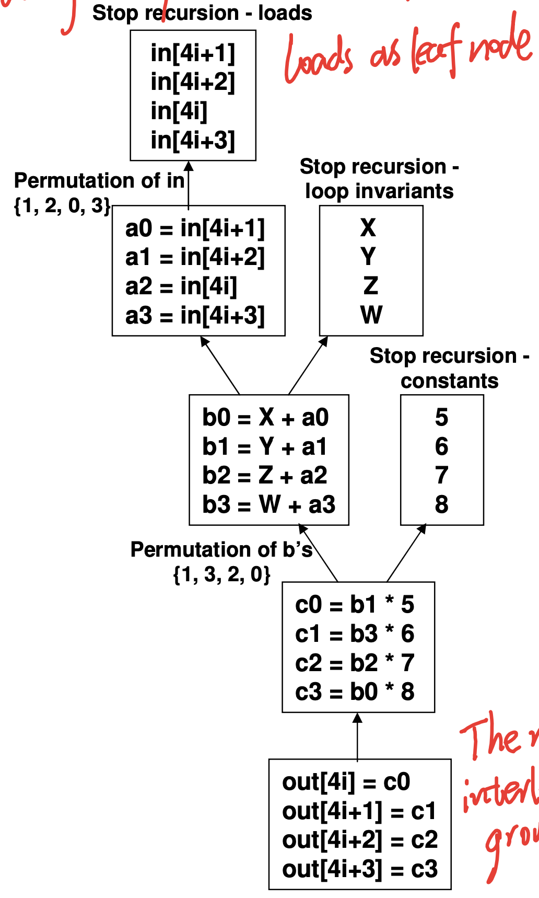
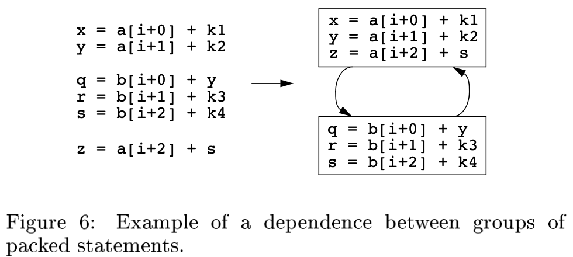
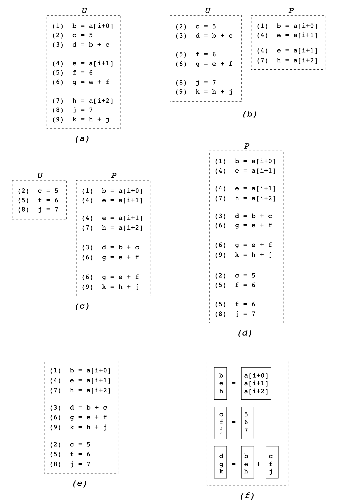

#### GCC Auto-Vectorization Papers Summary

*[1]. Autovectorization in GCC [2004]*

> GCC自动向量化的论文开山之作，主要讲述了：
>
> 1. 研究重心从传统向量化方法开始向基于SIMD机器的向量化方法转变
> 2. 向量化的前置步骤：数据依赖分析。构造ddg -> 在ddg中检测是否有scc -> 其他检测数据依赖的方法
> 3. 向量化的主要步骤： (1)analysis: 分析循环中是否有阻止向量化的因素。(2)transform: 标量语句转成向量语句
> 4. 需要特别关注的点：Memory reference（指array或pointer）的处理：
>    1. 循环之间的data ref不能有data dependency， pointer则需要额外考虑别名的问题，多版本Loop可以解决别名问题。
>    2. 对数据的Access Pattern，不同的Access Pattern会影响是否能向量化，而是否支持某个Access Pattern也与底层体系结构的相关指令支持有关。比如机器支持访问Odd/Even位置的元素，那么就可以支持2 strided Access Pattern。
>    3. 对齐，对齐处理有三个层次：
>       1. 静态的对齐分析
>       2. 通过loop transformation（peeling、versioning）来强制对齐
>       3. 对于剩下的不对齐访问的有效向量化
>
> 总结：当前自动向量化仅支持单BB，unit-stride，aligned，type of same sized，no loop-carried dependency、counted iterations的loop。

*[2]. Autovectorization in GCC—two years later [2006]*

> 自动向量化近两年的进展，主要讲述了：自动向量化加入了一些新的Feature：支持Reduction Pattern Recognition以及向量化reduction、multiple types、more loop forms，non-unit strided access[4]、multiple load/store generation for one scalar load/store、multiple reduction、type demotion/promotion、extending GIMPLE to represent desired vector abstraction.

*[3]. Multil-Platform Auto-Vectorization [2006]*

> 本文以GCC的Alignment Idioms和Reduction Idioms实现为例，探讨了实现一个适应多平台的Vectorizer所需要做的一些考虑，展示了提出的向量化方法如何适应多个不同的SIMD机器体系结构。
>
> 1. Alignment Idioms的设计：根据体系结构的不同，处理对齐主要有两种方法：
>    1. The direct realignment scheme: 当体系结构支持直接的unaligned load/store时，可以直接调用相应的指令进行不对齐地址的访问，同时GIMPLE也要增加`misaligned_indirect_ref(ptr, mis)`操作码，后续的RTL Expand阶段碰到这个操作码即可将其直接转成平台支持的不对齐访问指令。
>    2. The software-pipelined realignment scheme: 这个方法需要两个机制的支持：（1）`align_indirect_ref`，即在碰到不对齐地址时，将其转换为访问最近的对齐地址。（2）`realign_load`，通过permute或shift等操作，从两个vector中取出自己所需要的数据。
> 2. Reduction Idioms的设计：Reduction的前两步为初始化向量和运算，这两步操作很常见，各体系结构都支持，最后一步的Reduction才是关键，根据不同体系结构对规约操作的支持程度，reduction epilog有三种实现方式：
>    1. 使用target支持的专门的reduc_op idiom来直接完成规约过程
>    2. 使用vector shift来完成规约过程，即对一个向量折半相加，左一半加上右一半，如此递归得到最终结果，需要移动log2N次
>    3. 标量逐个运算

*[4]. Auto-vectorization of interleaved data for simd [2006]*

> 本文主要讲述了power of 2 strided access vectorization的具体实现，主要内容有：
>
> 1. GCC vectorization pass outline:
>
> ```
> vect_analyze_loop (struct loop *loop) { 
> 	loop_vec_info loopinfo;
> 	loop_vinfo = vect_analyze_loop_form (loop); //先确定loop form是否满足可向量化的条件
> 	if (!loop_vinfo) FAIL;
> 	if (!determine_VF (loopinfo)) FAIL;//根据循环中数据的类型以及target支持的向量长度来确定VF
> 	if (!analyze_data_refs (loopinfo)) FAIL;//找到所有data-ref，检查每个是否analyzable，即是否能分析出access function
> 	if (!analyze_scalar_cycles (loopinfo)) FAIL;//分析涉及到标量variable的有依赖的循环，比如reduction和induction
> 	if (!analyze_data_ref_dependences (loopinfo)) FAIL;//检查有依赖的dataref之间的内存访问距离是否为0，或大于VF；别名分析也在这个函数中进行
> 	if (!analyze_data_ref_accesses (loopinfo)) FAIL;//检查datarefs是如何访问内存的，地址如何变化
> 	if (!analyze_data_refs_alignment (loopinfo)) FAIL;//确保所有dataref的Alignment都是可以处理的，比如通过peeling或versioning，抑或直接调用target支持的unaligned access instruction处理
> 	if (!analyze_operations (loopinfo)) FAIL;//确保循环中所有的标量操作都有target上对应的向量操作支持，这样才能成功向量化
> 	LOOP_VINFO_VECTORIZABLE_P (loopinfo) = 1;
> 	return loopinfo;
> }
> 
> vect_transform_loop (struct loop *loop) { 
> 	FOR_ALL_STMTS_IN_LOOP(loop, stmt)
> 		vect_transform_stmt (stmt); //从上到下扫描所有标量语句，并在对应的位置插入用于替换标量语句的向量语句，可能多条标量语句对应一条向量语句（special Idiom），也可能一条标量语句对应多条向量语句（reduction）
> 	vect_transform_loop_bound (loop);//根据VF修改循环的步长和总循环次数
> }
> ```
>
> 2. 扩展vectorizer的能力以支持interleaved data
>
>    2.1 对循环分析过程的扩展：
>
>    - 第一步对所有load和store指令分组（load不能与store一组），分在同一组的load/store具有如下特点：1. 都访问同一数组；2.都具有同样的stride σ；3. 组内每个成员都有自己的index j，比如成员x和y都有index： jx, jy。且起始地址的差值与index差值相等：bx - by = jx - jy；4. 组内成员的起始地址差值不超过u*σ（u表示unit_size）；5. 即每个组都有一个leader，即index最小的成员的起始地址；6. 每个成员都维护一个指向自己组的指针，用于快速找到自己的组以及leader
>
>    - 第二步对所有的load和store进行成对的分析，即以第一个load/store为基准，逐个遍历剩下的load/store，然后以第二个load/store为基准，以此类推。这个分析过程在函数`analyze data ref dependences()`：
>
>      ```c
>      // 函数原始的分析过程如下：
>      if (distance_between_accesses <= (VF-1)*stride*u)
>        if (read,write) or (write,read) or (write,write)
>          ok = dep_resolve();
>        endif
>      endif
>      // 加上扩展的分析过程如下：
>      if ok and (distance_between_accesses < stride*u)
>        if (read,read) or (write,write)
>          ok = analyze_interleaving();
>        endif
>      endif
>      //analyze_interleaving函数会找到满足以下三个条件的pair of non-unit stride accesses，形成group
>      //1. Ux = Uy = U; 2.σ = σx = σy; 3.|bx - by| < σU
>      ```
>
>    - 第三步：遍历完所有的load/store后，就找到了所有的pairs，访问这些pairs，评估向量化代价。访问pairs的过程写到了`analyze_data_ref_accesses()`中
>
>    2.3 对循环转换过程的扩展
>
>    - 对于每个group，从leader开始遍历，先看其是否对齐，如果不对齐则使用peeling或者zero shift policy来使其对齐
>    - 生成σlog2σ条data reordering语句来处理power of 2 strided vectorization。（语句的形式是extract even/odd (for loads) and interleave low/high (for stores)）
>
> 3. 对SLP的展望
>
>    3.1 SLP是另一种向量化interleave数据的方式，它能处理循环内的并行，使用SLP有两个条件
>
>    -  所有对interleave数据的操作语句是同构的
>    - 访问没有gaps
>
>    3.2  SLP与Loop Vectorization的区别
>
>    - LoopVectorization只关注循环间的并行，VF个循环内的一条标量语句对应转换成一条向量语句（one-to-one），也就是循环内各条语句是独立的，不相关的。而SLP则关注循环内，设法将循环内的VF条标量语句向量化（VF-to-one）
>
>    3.3 Loop Vectorization + SLP = Loop-aware SLP
>
>    下面的例子说明了LoopVectorization方法与Loop-aware方法向量化的不同之处，首先待向量化的程序如下
>
>    ```c
>    for(int i = 0; i < len; i++){ 
>    	c[i] = a[2i]+b[2i];
>    	d[i] = a[2i+1]+b[2i+1];
>    }
>    ```
>
>    
>
>    - Loop Vectorization方法检测到interleaving load/store后，一般会直接rearranging data，然后再进行运算，如下代码所示：
>
>      ```c
>      for(int i = 0; i < len; i+=VF){
>        vector a1 = load(a[2i],a[2i+1],...,a[2i+VF-1]);
>        vector a2 = load(a[2i+VF],a[2i+VF+1],...,a[2i+2VF-1]); vector ao = extract odds(a1,a2);
>        vector ae = extract evens(a1,a2);
>        vector b1 = load(b[2i],b[2i+1],...,b[2i+VF-1]);
>        vector b2 = load(b[2i+VF],b[2i+VF+1],...,b[2i+2VF-1]); vector bo = extract odds(b1,b2);
>        vector be = extract evens(b1,b2);
>        vector abee = ae * be;
>        vector aboo = ao * bo;
>        vector abeo = ae * bo;
>        vector aboe = ao * be;
>        ce = abee - aboo;
>        co = abeo + aboe;
>        c[2i,2i+1,...,2i+VF-1]
>        c[2i+VF,2i+VF+1,...,2i+2VF-1] = interleave high(ce,co);
>      }
>      ```
>
>    - 而Loop-aware SLP方案则是推迟rearranging的时间，先进行运算，最后再arrange
>
>      ```c
>      for(int i = 0; i < len; i+=VF){
>        vector a1 = load(a[2i],a[2i+1],...,a[2i+VF-1]);
>        vector a2 = load(a[2i+VF],a[2i+VF+1],...,a[2i+2VF-1]); 
>        vector b1 = load(b[2i],b[2i+1],...,b[2i+VF-1]);
>        vector b2 = load(b[2i+VF],b[2i+VF+1],...,b[2i+2VF-1]); 
>        vector ab1 = a1 + b1;
>        vector ab2 = a2 + b2;
>        vector abo = extract odds(ab1,ab2);
>        vector abe = extract evens(ab1,ab2); c[i,i+1,...,i+VF-1] = abo;
>        d[i,i+1,...,i+VF-1] = abe;
>      }
>      ```
>
>    - **总之，Strided Loop Vectorization所做的连续访存分析为SLP提供了基础，而扩展LoopVectorization到Loop-aware SLP需要： 循环展开，生成更搞笑的vector instruction以及reordering operation**

*[5]. Loop-Aware SLP in GCC*

> 本文提出了一种更优的向量化算法，该算法结合了传统的loop-based approach和SLP Approach的优点，既考虑循环内基本块的并行，也考虑循环间的并行。主要内容有：
>
> 1. 主要思想以及范例：
>
>    > // Scalar:
>    >
>    > for(i = 0; i < n; i++) {
>    >
>    > ​	t1 = b[2i];
>    >
>    > ​	t2 = b[2i+1];
>    >
>    > ​	a[2i] = t1;
>    >
>    > ​	a[2i+1] = t2;
>    >
>    > ​	c[i] = C;
>    >
>    > }
>    >
>    > // SLP:
>    >
>    > for(i = 0; i < n; i++) {
>    >
>    > ​	vt = b[2i:2i+1];
>    >
>    > ​	a[2i:2i+1] = vt;
>    >
>    > ​	c[i] = C;
>    >
>    > }
>    >
>    > // Loop-based:
>    >
>    > vc = {C, C};
>    >
>    > for(i = 0; i < n; i+=2) {
>    >
>    > ​	vb1 = b[2i:2i+1];
>    >
>    > ​	vb2 = b[2i+2:2i+3];
>    >
>    > ​	vt1 = extract_even(vb1, vb2);
>    >
>    > ​	vt2 = extract_odd(vb1, vb2);
>    >
>    > ​	va1 = interleave_high(vt1, vt2);
>    >
>    > ​	va2 = interleave_low(vt1, vt2);
>    >
>    > ​	a[2i:2i+1] = va1;
>    >
>    > ​	a[2i+2:2i+3] = va2;
>    >
>    > ​	c[i:i+1] = vc;
>    >
>    > }
>    >
>    > //loop-aware SLP:
>    >
>    > vc = {C, C};
>    >
>    > for(i = 0; i < n; i+=2) {
>    >
>    > ​	vb1 = b[2i:2i+1];
>    > ​	vb2 = b[2i+2:2i+3];
>    > ​	a[2i:2i+1] = vb1;
>    > ​	a[2i+2:2i+3] = vb2;
>    > ​	c[i:i+1] = vc;
>    >
>    > }
>
> 2. 现有的仅有Loop-based方法的Vectorizer实现
>
> 3. 将现有的Vectorizer扩展成Loop-aware SLP Vectorizer的步骤
>
>    1. interleaving分析：从下至上扫描循环内的所有语句以构建computation-tree，扫描时首先找到interleaved store group（几条写连续地址的store语句）作为计算树的根节点，然后根据use-def链递归的寻找store语句中RHS的Def，直到找到计算树的叶节点则停止，叶节点即loop-invariant或者interleaved memory address，下面是计算树的例子：
>
>       
>
>       此外，Reduction的分析过程略有不同，其根节点是reduction computation stmt。接下来需要确定UF(Unrolling Factor)以及通过遍历计算树来进行Data Dependency分析。
>
>    2. SLP分类
>
>       - Pure SLP：只在循环内部进行SLP并行，从而不考虑循环间的并行性，所以Group Size(GS)等于Vector Size(VS)，不需要循环展开。
>       - Hybrid SLP：同时考虑循环内和循环间的并行性，循环内的并行用SLP，循环间并行用Loop-based Approach，所以当GS < VS时，就需要循环展开。
>
>       按照向量化的程度又可分为以下两类：
>
>       - Full Loop Vectorization: 向量化后的循环内只有向量语句，所有的标量语句都被SLP或者loop-vectorization给完美向量化了
>       - Partial Loop Vectorization: 向量化后的循环内仍有部分标量语句，也就是不完美的向量化
>
>    3. Decision：使用何种方式进行向量化
>       - 对计算树是否进行SLP向量化
>       - 是否SLP的一个关键因素是对齐，因为不对齐访问内存开销很大
>       - 对不属于SLP计算树的标量语句是否进行Loop-vectorization
>       - 循环的次数以及UF需要考虑
>       - Group内statement访问地址如果是乱序的，需要加入vec_perm语句重排序
>
>    4. Transformation：Top-down scan of the loop's original scalar statements in their orig order
>       - 先找到属于SLP计算树的第一条语句（一般是first load），生成向量语句并插入。
>       - 对于剩下的语句，如果需要进行loop-vectorization，则生成向量语句，如果不需要则保持不动。


*6. Exploiting Superword Level Parallelism with Multimedia Instruction Sets (2000)*

> 基本块向量化的开山之作，主要阐述了SLP的基本原理和算法实现，其主要内容可概括为：
>
> 1. SLP与循环向量化的不同之处，通过两个例子来说明
>
> ```c
> // Example 1
> // a) Original loop:
> for (i = 0; i < 16; i++) {
> 	localdiff = ref[i] - curr[i];
> 	diff += abs(localdiff);
> }
> // 对于以上循环，由于循环体中存在函数调用以及loop-carried dependence，编译器无法对其进行向量化
> // b) After scalar expansion and loop fission:
> for (i = 0; i < 16; i++) {
> 	T[i] = ref[i] - curr[i];
> }
> for (i = 0; i < 16; i++) {
> 	diff += abs(T[i]);
> }
> //通过标量扩展和循环拆分，可以实现向量化，这是循环向量化的思路
> // c)和d)就是SLP的思路了，两者都可以向量化，但是SLP的优点是不需要复杂的变换，省去了一些变换开销
> // c) SLP exposed after unrolling:
> for (i = 0; i < 16; i += 4) {
> 	localdiff = ref[i+0] - curr[i+0];
> 	diff += abs(localdiff);
> 	
> 	localdiff = ref[i+1] - curr[i+1];
> 	diff += abs(localdiff);
> 	
> 	localdiff = ref[i+2] - curr[i+2];
> 	diff += abs(localdiff);
> 	
> 	localdiff = ref[i+3] - curr[i+3];
> 	diff += abs(localdiff);
> }
> // d) Packable statement grouped together after renamning
> for (i = 0; i < 16; i += 4) {
> 	localdiff0 = ref[i+0] - curr[i+0];
> 	localdiff1 = ref[i+1] - curr[i+1];
> 	localdiff2 = ref[i+2] - curr[i+2];
> 	localdiff3 = ref[i+3] - curr[i+3];
> 	diff += abs(localdiff0);
> 	diff += abs(localdiff1);
> 	diff += abs(localdiff2);
> 	diff += abs(localdiff3);
> }
> 
> // Example 2
> do {
> 	dst[0] = (src1[0] = src2[0]) >> 1;
> 	dst[1] = (src1[1] = src2[1]) >> 1;
> 	dst[2] = (src1[2] = src2[2]) >> 1;
> 	dst[3] = (src1[3] = src2[3]) >> 1;
> 	
> 	dst += 4;
> 	src1 += 4;
> 	src2 += 4;
> } while (dst != end);
> // 循环向量化处理不了这个循环，而SLP可以轻松搞定
> ```
>
> 2. SLP算法步骤：
>
>    1. Loop Unrolling：目的是形成可并行的基本块
>
>    2. Alignment Analysis：分析data ref的对齐情况
>
>    3. Pre-optimization: 可能得预先优化手段包括：常量传播、复制传播、死代码消除、公共子式消除、循环不变量移动、多余load/store消除、标量重命名等等。这些优化手段为了向量化铺平道路。
>
>    4. 识别连续的访存语句作为SLP的种子：参照上述分析过程中得到的对齐和数组信息，找到一对没有依赖的，同构的语句，将其作为一个Pack打包到PackSet中。
>
>    5. 扩展PackSet：得到种子后，可以顺着种子的use-def链来查找对应的语句并将其打包到PackSet中（比如图d），也可以查找新的种子Pack（比如图c）。当多个地方都用到了某一条相同的def语句时，打包方式可以有多种，这就需要一个Cost Model来找出最佳的打包方式。
>
>    6. 合并Pack到更大的Group：当一个Pack的右语句与另一个Pack的左语句相同时，可以合并这两个Pack，组成更大的Group，比如图d中的前两个Pack。
>
>    7. 调度：Group中原有的语句顺序可能会有依赖，可以通过调换语句的顺序来消除依赖，但是一旦出现循环依赖，则无法消除，只能去掉一个Group，比如Figure 6中的例子。
>
>       
>
>       **下图是SLP的范例：**
>
>    
>
> 3. SLP算法的伪代码

